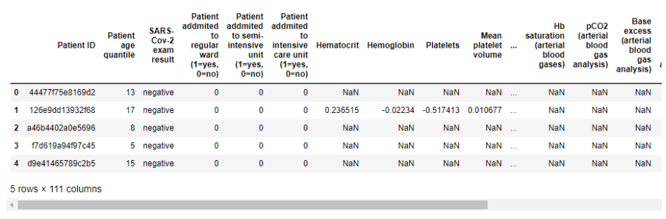
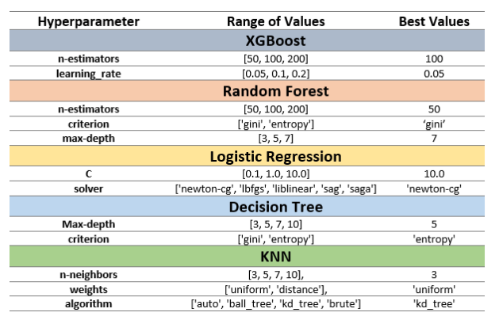
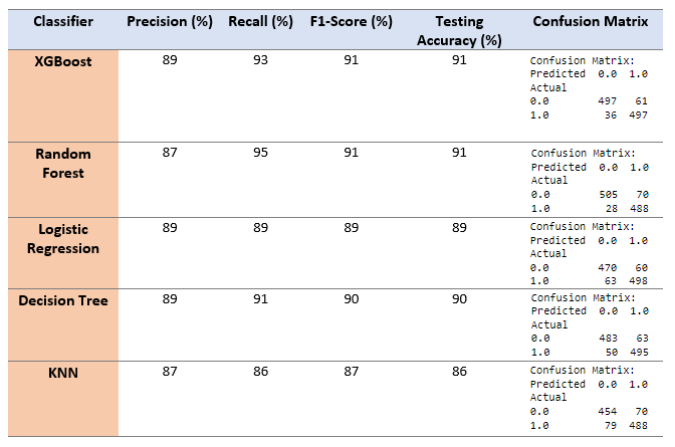
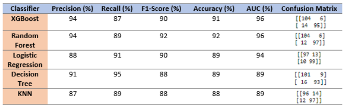

# Prediction-of-COVID-19-Using-Machine-Learning-Models

# Overview
This project focuses on utilizing machine learning for predicting COVID-19 diagnoses using a dataset from Hospital Israelita Albert Einstein, São Paulo, Brazil. The experiments involved Cross-Validation and Holdout methods, evaluating five models. XGBoost and Random Forest demonstrated superior performance with 91% accuracy, emphasizing the significance of features like Basophils and Patient Age Quantile. The discussion delves into model strengths and limitations, offering valuable insights for ongoing research in enhancing COVID-19 diagnosis through machine learning.

## Dataset Description
The dataset for this report, sourced from Kaggle: https://www.kaggle.com/datasets/einsteindata4u/covid19 , originates from patients receiving medical care at the Hospital Israelita Albert Einstein in São Paulo, Brazil. The dataset consists of confidential samples collected through RT-PCR tests for SARS-CoV-2 and other laboratory tests, with 5,644 rows and 111 columns. 

## Data Pre-processing
### Dropping Unnecessary Columns
The columns , 'Patient admitted to regular ward (1=yes, 0=no)', 'Patient admitted to semi-intensive unit (1=yes, 0=no)', 'Patient admitted to intensive care unit (1=yes, 0=no)' would not add anything to our analysis. So, we will drop these columns from the dataset

### Handling Missing Values
Approximately 50% of the columns had over 90% missing values. These columns were removed, resulting in a new dataset of 5,644 rows and 35 columns 

### Filtering Data
The data was filtered to include positive SARS-CoV-2 exam results and non-null values in the 'Hematocrit' or 'Urine - Density' columns. This resulted in a focused dataset of 1,091 rows and 35 columns.

### Encoding Categorical Features
In this dataset, one third 33.3% of the variables are categorical (data type: object). We will use LabelEncoder to convert them into numerical values, such as encoding 'SARS-Cov-2 exam result' column as 1 for positive and 0 for negative. Once the categorical variables are encoded, all data types will be converted to integer for consistency.

### Data Balance
After the four above steps, the dataset has 1091 rows and 35 columns. By analysing the class distribution, we can see a well-balanced dataset with a 51.1% positive case and a 48.9% negative case. This optimal state of the dataset allows for machine learning model analysis.

## Machine Learning Models
The report evaluates five classifiers: XGBoost, Random Forest (RF), Decision Tree (DT), Logistic Regression (LR), and K-Nearest Neighbors (KNN).

# Experiment-1
### Cross-Validation Method
In Experiment-1, we employed the Cross-Validation (CV) method, a machine learning technique assessing model performance on unseen data. The dataset was divided into ten folds, with k-1 folds used for training and the remaining one for validation in each iteration. This technique helps provide a more robust evaluation of the models.

### Hyperparameters Optimization
To determine the best combination of hyperparameters for the ML models (XGBoost, Random Forest, Decision Tree, Logistic Regression, K-Nearest Neighbors), a grid search technique with cross-validation was utilized. Optimal hyperparameters were identified, and the models were trained using these parameters.

### Result Evaluation
Performance outcomes were obtained for different CV fold values, and the classifiers were compared based on metrics such as F1-score, testing accuracy, precision, and recall. The results reveal the highest performing classifiers based on F1-score, testing accuracy, precision, and recall are XGBoost and RF, both achieving 91% accuracy. XGBoost had a recall of 93%, while Random Forest had a recall of 95%, indicating an even higher ability to correctly identify true positives. LR, DT, and KNN have slightly lower scores, with these metrices ranging between 86% and 89%. The confusion matrices showed that RF and XGBoost have only 98 and 97 misclassifications out of 1091 cases, respectively, making them the top recommended classifiers for this task.

# Experiment-2
### Holdout Method with Result Evaluation
In the holdout method, 20% of the data is used for testing and 80% for training. The results indicate that RF had the highest accuracy and F1-score at 92%, while XGBoost had closer accuracy and F1-score at 91% and 90%. Both RF and XGBoost had the highest AUC at 96%, with LR also performing well with an AUC of 94%. On the other hand, DT and KNN performed the least well, having 89% of accuracy. The confusion matrix also reveals that out of 219 cases, RF model correctly predicted 97 positive cases and 104 negative cases, with only 18 incorrect predictions, which is the lowest compared to the other models. 

### Important Features using SHAP Values
The SHapley Additive exPlanations (SHAP) value is utilized to identify the most informative predictors that significantly contribute to the decision-making process. By calculating the Shapley value of each feature, the SHAP value provides an explanation of a classifier's prediction, revealing the contribution of each feature to the outcome. We found out the top 10 most important features. Among these, Basophils, Monocytes, Leukocytes, and Lymphocytes - which are types of white blood cells. Additionally, patient age quantile is also found to be a highly important feature in the prediction.

# Discussion and Conclusion
This study assessed five ML models for COVID-19 diagnosis with the goal of assisting medical professionals in choosing the best models for particular applications. According to our findings, both XGBoost and RF managed to attain a 91% accuracy rate, however RF had a higher recall for true positives than XGBoost, at 95% as opposed to 93%. Both models exhibited high AUC values, with RF performing somewhat better score of 95.7% with cross-validation. Again, applying 20% test data samples in the holdout approach, both models had the highest AUC of 96%, but RF had the highest accuracy and F1-Score at 92%. Our research suggests that RF could be a better option for this classification challenge. The top two crucial features for the model's prediction are Basophils and Patient Age Quantile. However, one limitation of this report is that the dataset only includes patients who had blood or urine testing, which may not adequately represent the total population. The accuracy of the diagnosis may also be impacted by other demographic and clinical parameters that weren't considered in the model's performance. Therefore, further investigation is necessary to establish the influence of other clinical factors on ML models' performance in COVID-19 diagnosis.
